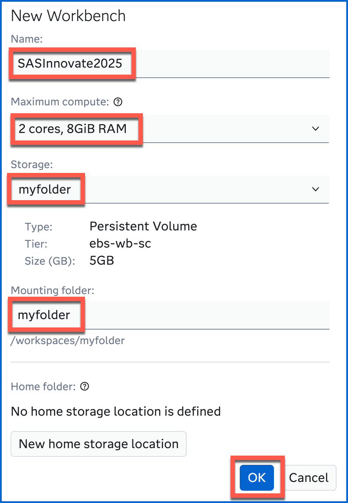
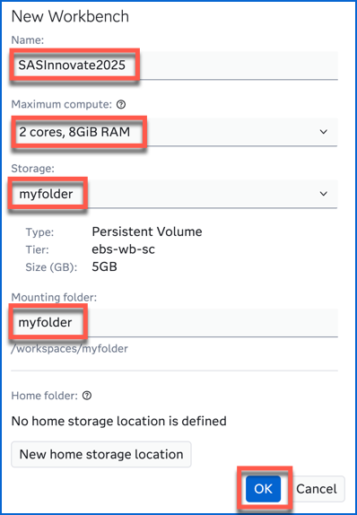

# SAS® Viya® Workbench + Visual Studio Code: A Dynamic Duo for Data Science

This hands-on workshop demonstrates how to leverage the native integration of Visual Studio Code within SAS Viya Workbench for efficient data science programming. You'll learn to seamlessly write and execute both SAS and Python code directly in the embedded VS Code environment, streamlining your workflow.

## Log in to SAS Viya Workbench

Follow instructor's directions to get access to SAS Viya Workbench.

## Create a new workbench

In SAS Viya Workbench's welcome screen, click on **New workbench**:

In the following screen, you have access to multiple settings.

A workbench includes the following components:

- **Name**: A unique identifier for the workbench.
- **Compute Configuration**: Allows users to select the appropriate amount of computational resources based on their requirements.
- **Storage**: Defines the type and size of storage for data and programs.
- **Mounting Folder**: Specifies the path used to access the defined storage.
- **Home Folder** (optional): Provides a shared location for settings and configurations across multiple workbenches.

Name the new workbench **SASInnovate2025**.

Choose **2 cores, 8GiB RAM** (the smallest configuration) for the compute size.

Choose the default **myfolder** storage definition and default **myfolder** mounting folder.

No **home folder** will be needed for this hands-on.

