# SAS® Viya® Workbench + Visual Studio Code: A Dynamic Duo for Data Science

This hands-on workshop demonstrates how to leverage the native integration of Visual Studio Code within SAS Viya Workbench for efficient data science programming. You'll learn to seamlessly write and execute both SAS and Python code directly in the embedded VS Code environment, streamlining your workflow.

## Logging in to SAS Viya Workbench

Follow instructor's directions to get access to SAS Viya Workbench.

## Creating a new workbench

In SAS Viya Workbench's welcome screen, click on **New workbench**:

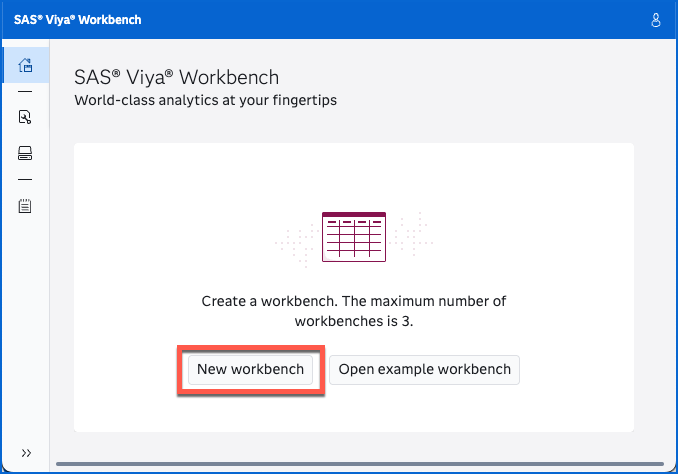

In the following screen, you have access to multiple settings.

A workbench includes the following components:

- **Name**: A unique identifier for the workbench.
- **Compute Configuration**: Allows users to select the appropriate amount of computational resources based on their requirements.
- **Storage**: Defines the type and size of storage for data and programs.
- **Mounting Folder**: Specifies the path used to access the defined storage.
- **Home Folder** (optional): Provides a shared location for settings and configurations across multiple workbenches.

Name the new workbench **SASInnovate2025**.

Choose **2 cores, 8GiB RAM** (the smallest configuration) for the compute size.

Choose the default **myfolder** storage definition and default **myfolder** mounting folder.

No **home folder** will be needed for this hands-on.

Click **OK**.

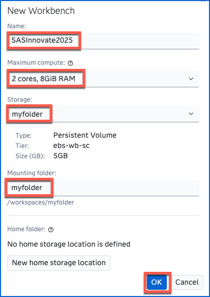

You should see your workbench created now.

You can also explore the UI and look at the list of workbenches and storages:

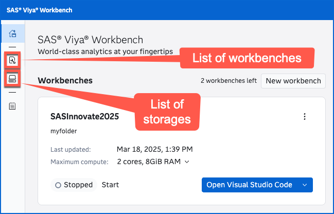

Let's start the workbench:

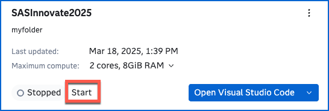

It should start in seconds. Now you have a computing environment ready to use.

You can then choose your favorite IDE to interact with this computing environment.

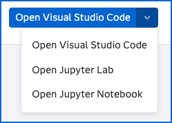

Are you a SAS developer? A Python programmer? A R specialist?

Let's open **Visual Studio Code** as this will be the main focus of this hands-on:

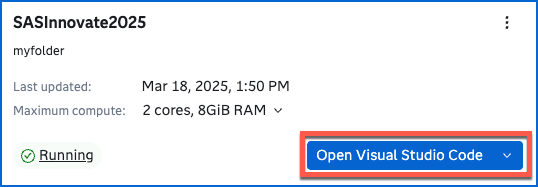

## Working in Visual Studio Code

You should see Visual Studio Code opening in a new browser tab:

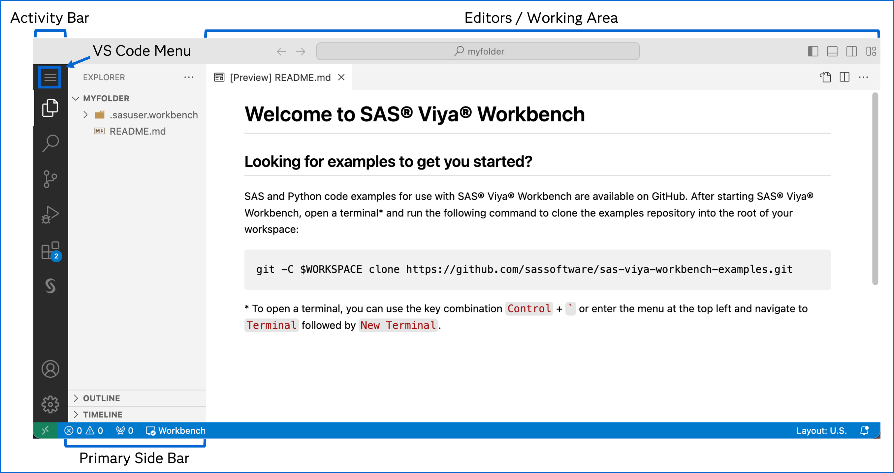

If you are not familiar with VS Code, take the time to explore the user interface.

The **Activity Bar** displays various views and applications, including SAS. Additional applications can be installed through VS Code **extensions**.

The **Primary Side Bar** displays contextual information based on the activity selected.

The **Working Area** is the place where you edit and run code, control logs and display results.

The **Explorer** activity will be the main spot to organize your data and program files:

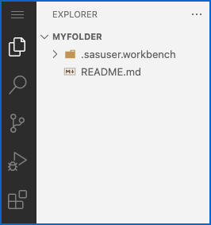

The **Source Control** activity will be important when you work with a GIT repository:

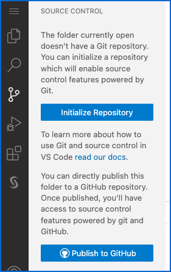

The Extensions activity allows you to add extensions, customize your environment, improve your productivity with open-source tools, enrich your UI with syntax highlighting editors and much more:

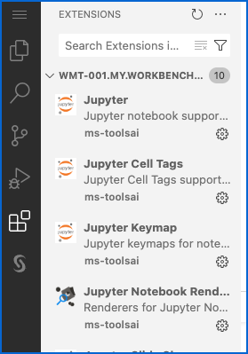

SAS is a perfect example of what an extension can bring to your environment: extend default VS Code capabilities with additional features, here by integrating SAS:

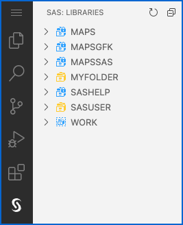

You probably notice SAS libraries that you are familiar with, like SASHELP, SASUSER and WORK.

You also notice the MYFOLDER library which is a default library pointing to your default folder. You can use it if you want or you can defined additional ones.

## Customizing VS Code

Let's customize VS Code and choose a SAS dark theme.

Open the VS Code Menu and select **File** > **Preferences** > **Theme** > **Color Theme**:

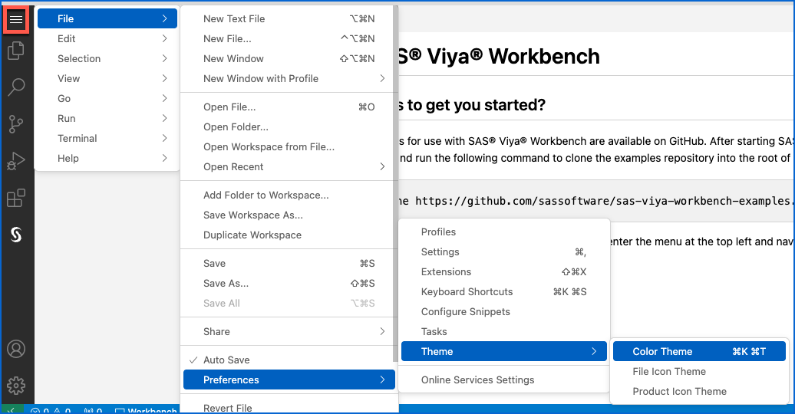

Start typing SAS and choose SAS Dark theme:

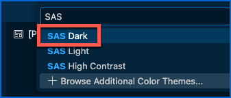

Back in the Explorer, I can see I'm in the default MYFOLDER folder.

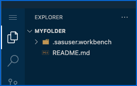

Anything stored in that folder will be saved in the storage area that I defined earlier.

This is independent of the compute environment that I am using.

I can then switch from a compute configuration to a bigger one easily while using the same data and programs.

## Working with GIT

