# SAS® Viya® Workbench + Visual Studio Code: A Dynamic Duo for Data Science

This hands-on workshop demonstrates how to leverage the native integration of Visual Studio Code within SAS Viya Workbench for efficient data science programming. You'll learn to seamlessly write and execute both SAS and Python code directly in the embedded VS Code environment, streamlining your workflow.

Contents:

- [Logging in to SAS Viya Workbench](#logging-in-to-sas-viya-workbench)
- [Creating a new workbench](#creating-a-new-workbench)
- [Working in Visual Studio Code](#working-in-visual-studio-code)
- [Customizing VS Code](#customizing-vs-code)
- [Working with Git](#working-with-git)
- [Working with data](#working-with-data)
  - [Reading SAS data sets](#reading-sas-data-sets)
  - [Reading Parquet data](#reading-parquet-data)
  - [Reading a CSV file](#reading-a-csv-file)
  - [Reading a JSON file](#reading-a-json-file)
- [Accessing other data](#accessing-other-data)
  - [Uploading data](#uploading-data)
  - [Accessing databases and other cloud object storage](#accessing-databases-and-other-cloud-object-storage)
- [Interacting with Git and GitHub](#interacting-with-git-and-github)
- [Working with SAS notebooks](#working-with-sas-notebooks)

## Logging in to SAS Viya Workbench

Follow instructor's directions to get access to SAS Viya Workbench.

## Creating a new workbench

In SAS Viya Workbench's welcome screen, click on **New workbench**:


In the following screen, you have access to multiple settings.

A workbench includes the following components:

- **Name**: A unique identifier for the workbench.
- **Compute Configuration**: Allows users to select the appropriate amount of computational resources based on their requirements.
- **Storage**: Defines the type and size of storage for data and programs.
- **Mounting Folder**: Specifies the path used to access the defined storage.
- **Home Folder** (optional): Provides a shared location for settings and configurations across multiple workbenches.

Name the new workbench **SASInnovate2025**.

Choose **2 cores, 8GiB RAM** (the smallest configuration) for the compute size.

Choose the default **myfolder** storage definition and default **myfolder** mounting folder.

No **home folder** will be needed for this hands-on.

Click **OK**.


You should see your workbench created now.

You can also explore the UI and look at the list of workbenches and storages:


Let's start the workbench:


It should start in seconds. Now you have a computing environment ready to use.

You can then choose your favorite IDE to interact with this computing environment.


Are you a SAS developer? A Python programmer? A R specialist?

Let's open **Visual Studio Code** as this will be the main focus of this hands-on:


## Working in Visual Studio Code

You should see Visual Studio Code opening in a new browser tab:


If you are not familiar with VS Code, take the time to explore the user interface.

The **Activity Bar** displays various views and applications, including SAS. Additional applications can be installed through VS Code **extensions**.

The **Primary Side Bar** displays contextual information based on the activity selected.

The **Working Area** is the place where you edit and run code, control logs and display results.

The **Explorer** activity will be the main spot to organize your data and program files:


The **Source Control** activity will be important when you work with a GIT repository:


The Extensions activity allows you to add extensions, customize your environment, improve your productivity with open-source tools, enrich your UI with syntax highlighting editors and much more:


SAS is a perfect example of what an extension can bring to your environment: extend default VS Code capabilities with additional features, here by integrating SAS:


You probably notice SAS libraries that you are familiar with, like SASHELP, SASUSER and WORK.

You also notice the MYFOLDER library which is a default library pointing to your default folder. You can use it if you want or you can defined additional ones.

## Customizing VS Code

Let's customize VS Code and choose a SAS dark theme.

Open the VS Code Menu and select **File** > **Preferences** > **Theme** > **Color Theme**:


Start typing "SAS" and choose SAS Dark theme:


Back in the Explorer, you can see you're in the default MYFOLDER folder.


Anything stored in that folder will be saved in the storage area that you defined earlier.

This is independent of the compute environment that you're using.

You can then switch from a compute configuration to a bigger one easily while using the same data and programs.

## Working with Git

Working with Git repositories in VS Code is extremely easy.

VS Code has integrated source control management (SCM) and includes Git support out-of-the-box.

Let's clone a GitHub repository.

Open the Command Palette by selecting the VS Code Menu > **View** > **Command Palette...**:

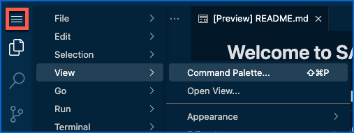

Start typing "Git C" and select **Git: Clone**:

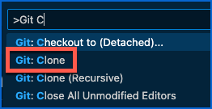

Paste the following GitHub repository URL and press Enter:

```https://github.com/SAS-Innovate-2025/SAS-Viya-Workbench-and-VS-Code.git```

:warning: Do NOT select **Clone from GitHub** as it will ask you to authenticate which we don't want.

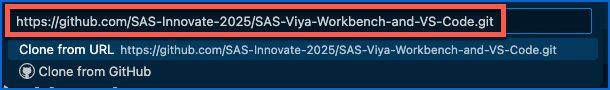

Navigate to ```/workspaces/myfolder/``` (use the "2 dots"  to go up one level as you probably start from ```/home/sas```) or type the path, and click **OK**:

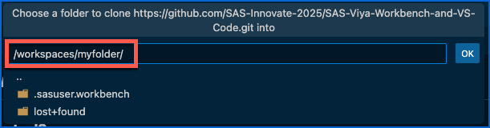

When prompted about opening the cloned repository, click **Cancel**. We will still be able to access the repository.

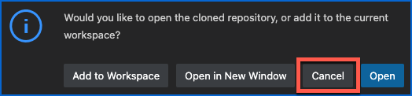

You should now see your cloned repository folder in **Explorer**:

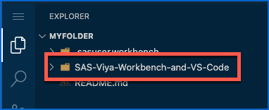

## Working with data

​As a data scientist at an online personal styling service, you’ll use machine learning models to help us analyze customer churn. Customer “churn” simply means that our client has canceled their premium clothing subscription. And since it often is more difficult to find a new customer than keep an existing one, you will help us identify which clients are likely on the cusp of churning, so that we can find ways to retain them.​

In the cloned repository, explore the **Data** folder. It contains various data sets for our project in various formats:

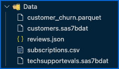

- Customer churn provides metrics about customer activity over the last few months,
- Customers describes customers’ attributes, such as their estimated income, homeowner status and birth date,
- Reviews lists customer reviews on recent purchases,
- Subscriptions provides meaningful details about the customer’s subscriptions,
- And technical support evaluations gives the customers’ feedback on recent interactions with Technical Support.

In this hands-on, we will focus on the data preparation part of the project.

We have two SAS data sets, one CSV file, one JSON file and one Parquet data set.

Let's see how we can integrate those data files.

*Note: Storing data in a Git repository is generally not recommended. While Git excels at version control and collaboration on text-based files like source code, it is not optimized for handling large datasets or binary files. In this hands-on example, we stored sample data in Git for simplicity.*

### Reading SAS data sets

To read SAS data sets, we just need a SAS library.

Create a new SAS file by selecting the VS Code Menu > **File** > **New File...**:

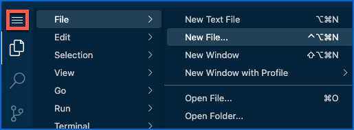

Select **SAS File**:

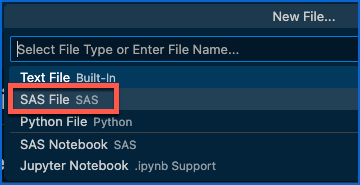

In the new SAS file, copy the following code:

```sas
libname churn "" ;
```

In the Explorer, select the **Data** folder, right-click and select **Copy Path**:

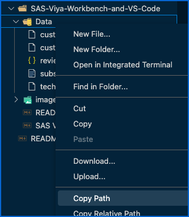

Paste the copied path between the double-quotes in your code.

This should look like the following:

```sas
libname churn "/workspaces/myfolder/SAS-Viya-Workbench-and-VS-Code/Data" ;
```

You're ready to submit this code using the Run button:

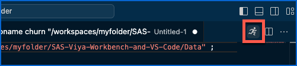

A new pane should have popped up showing the SAS log for this code submission. You're like in the good old SAS Display Manager!

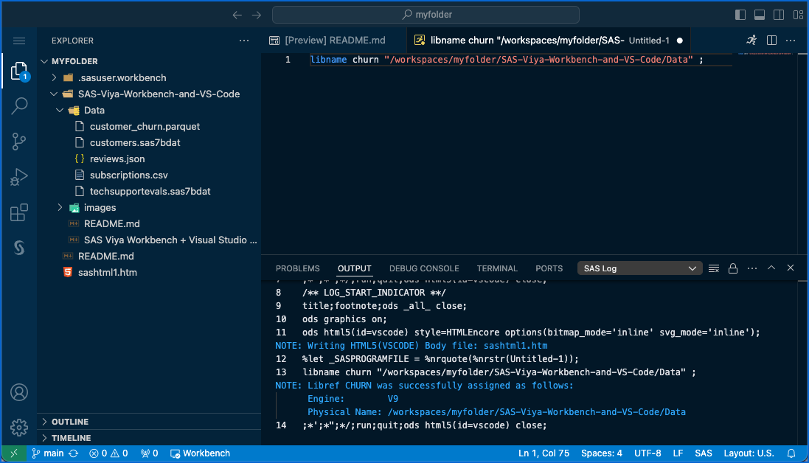

Now, go to the SAS activity (extension) to view your SAS libraries.

You should see the CHURN library and can open the CUSTOMERS table:

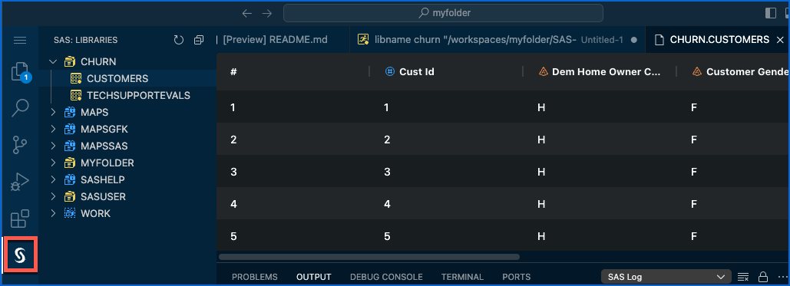

### Reading Parquet data

We will access the Parquet data set using a SAS library. The Parquet file is at the exact same location as the SAS data sets. We will just use a different library engine.

*Note: Parquet is a **columnar storage file format** optimized for efficient data storage and retrieval. It is commonly used in big data processing frameworks like Apache Spark and Hadoop due to its ability to handle large datasets with high performance and reduced storage requirements.*

Back in your SAS file, duplicate the libname statement.

Change the library name to ```churn_pq``` for churn parquet.

Add the ```parquet``` engine between the library name and the path. 

You should have something similar to this:

```sas
libname churn_pq parquet "/workspaces/myfolder/SAS-Viya-Workbench-and-VS-Code/Data" ;
```

Run this line of code.

Check the log:

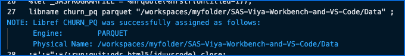

And go to the SAS libraries to see if you can view the Parquet data set:

Indeed, you normally can:

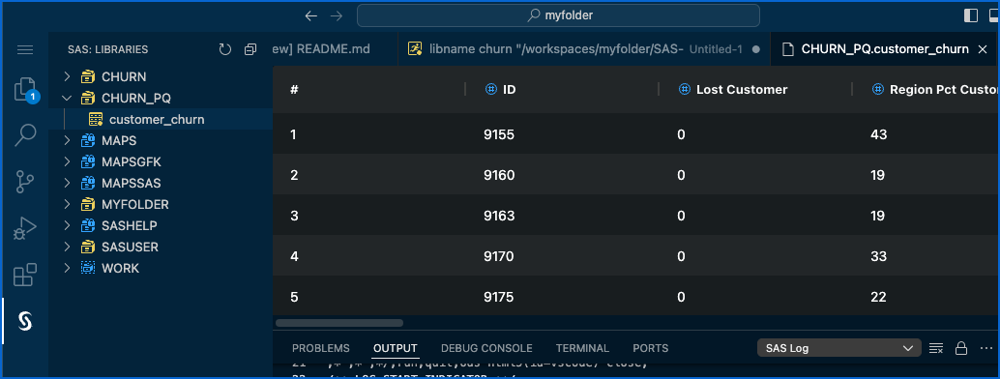

### Reading a CSV file

To read a CSV file, we will need to import it into a SAS data set.

In your SAS file, add the following code:

```sas
proc import file="" out=subscriptions dbms=csv replace ;
run ;
```

Copy the path to the ```subscriptions.csv``` file (right-click on the file > **Copy Path**) and insert it between the double-quotes.

This should look like the following:

```sas
proc import file="/workspaces/myfolder/SAS-Viya-Workbench-and-VS-Code/Data/subscriptions.csv" out=subscriptions dbms=csv replace ;
run ;
```

Run this SAS procedure, check the log and view the resulting data in the WORK library:

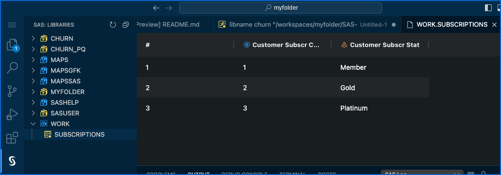

### Reading a JSON file

To read a JSON file, we will also use a special library engine.

In your SAS file, add the following code:

```sas
libname rev json "" ;
proc datasets lib=rev ;
quit ;
```

Copy the path to the ```reviews.json``` file (right-click on the file > **Copy Path**) and insert it between the double-quotes.

This should look like the following:

```sas
libname rev json "/workspaces/myfolder/SAS-Viya-Workbench-and-VS-Code/Data/reviews.json" ;
proc datasets lib=rev ;
quit ;
```

Run the code.

The DATASETS procedure generates some output and should list the logical tables stored in the JSON file.

So, you should see now a **Results** pane popping up:

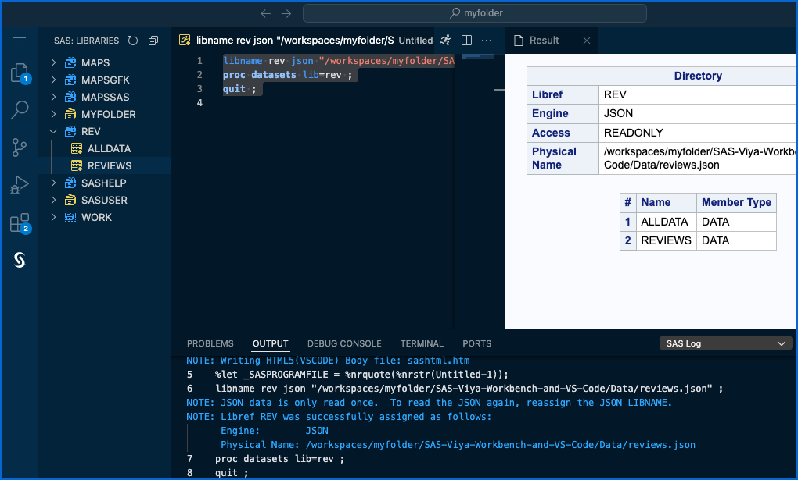

Here we go. We have our three SAS pillars in VS Code: editor, log and output.

Check the log.

Open the resulting REVIEWS table in the REV library.

## Accessing other data

### Uploading data

### Accessing databases and other cloud object storage

## Interacting with Git and GitHub

Save the SAS program by selecting VS Code Menu > **File** > **Save** and save it in your cloned repository under Programs.

Navigate to ```/workspaces/myfolder/SAS-Viya-Workbench-and-VS-Code/Programs``` and name it ```data_access.sas```:

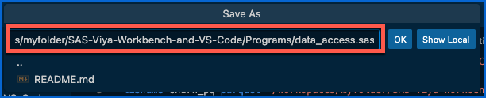

Click **OK**.

You should notice that VS Code has detected a change in your cloned repository. Indeed, your **Source Control** activity should have a badge with at least one pending change:

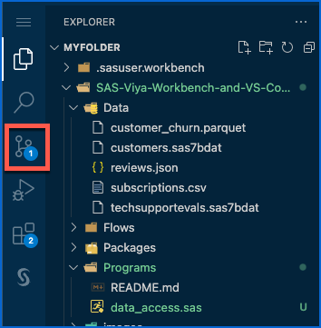

Open the **Source Control** activity and observe that the new SAS program that you created is listed as a pending change in the local cloned repository:

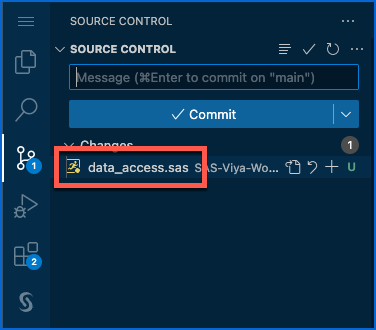

You can go ahead and commit the change in the local cloned repository.

Click the **Stage All Changes** button:

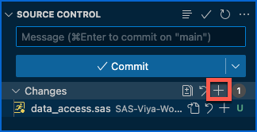

*Note: Clicking either of the + buttons will have the same effect, as there is only one change.*

Add a commit message and click **Commit**:

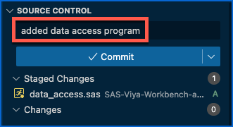

All right. There's a few additional configuration steps needed to be able to commit to a git repository. Click **Cancel**:

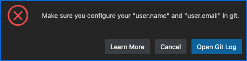

We'll stop here but you get the idea.

Once you commit a change locally, you'd have to push the changes to the remote repository, GitHub here, which would require to be authenticated against GitHub.

## Working with SAS notebooks

One of the nicest features of SAS integration in VS Studio Code is the ability to create notebooks.

A SAS notebook is similar to a Jupyter notebook. It allows you to combine text and SAS instructions and therefore document your actions in a nice-looking way.

Create a new file by selecting the VS Code Menu > **File** > **New File...**.

Select **SAS Notebook**:

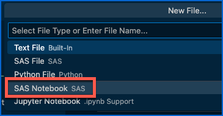


