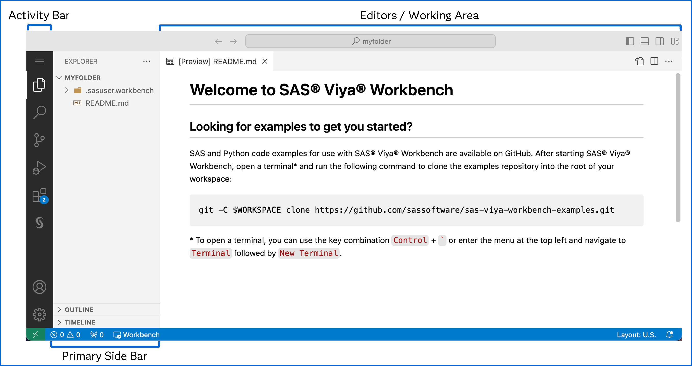

# SAS® Viya® Workbench + Visual Studio Code: A Dynamic Duo for Data Science

This hands-on workshop demonstrates how to leverage the native integration of Visual Studio Code within SAS Viya Workbench for efficient data science programming. You'll learn to seamlessly write and execute both SAS and Python code directly in the embedded VS Code environment, streamlining your workflow.

## Logging in to SAS Viya Workbench

Follow instructor's directions to get access to SAS Viya Workbench.

## Creating a new workbench

In SAS Viya Workbench's welcome screen, click on **New workbench**:

In the following screen, you have access to multiple settings.

A workbench includes the following components:

- **Name**: A unique identifier for the workbench.
- **Compute Configuration**: Allows users to select the appropriate amount of computational resources based on their requirements.
- **Storage**: Defines the type and size of storage for data and programs.
- **Mounting Folder**: Specifies the path used to access the defined storage.
- **Home Folder** (optional): Provides a shared location for settings and configurations across multiple workbenches.

Name the new workbench **SASInnovate2025**.

Choose **2 cores, 8GiB RAM** (the smallest configuration) for the compute size.

Choose the default **myfolder** storage definition and default **myfolder** mounting folder.

No **home folder** will be needed for this hands-on.

Click **OK**.

You should see your workbench created now.

You can also explore the UI and look at the list of workbenches and storages:

Let's start the workbench:

It should start in seconds. Now you have a computing environment ready to use.

You can then choose your favorite IDE to interact with this computing environment.

Are you a SAS developer? A Python programmer? A R specialist?

Let's open **Visual Studio Code** as this will be the main focus of this hands-on:

## Working in Visual Studio Code

You should see Visual Studio Code opening in a new browser tab:

If you are not familiar with VS Code, take the time to explore the user interface.

The **Activity Bar** displays various views and applications, including SAS. Additional applications can be installed through VS Code **extensions**.

The **Primary Side Bar** displays contextual information based on the activity selected.

The **Working Area** is the place where you edit and run code, control logs and display results.

